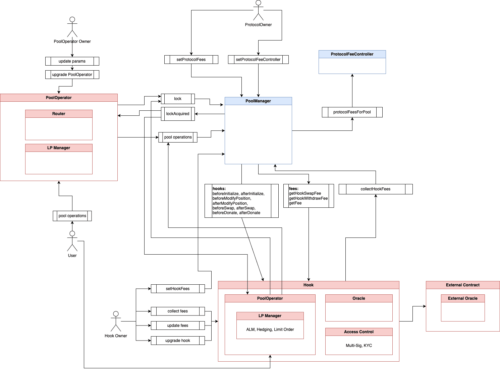

# C9: Uniswap V4 Hook

## Control Objective

When building a Uniswap V4 hook, it is necessary to follow the standard and create secure contracts based on it. Learn from past mistakes and threats that have been identified.

Ensure that a verified contract satisfies the following high-level requirements:
- Contracts follow the best security practices for UniswapV4 hooks,
- Hook cannot make drastic changes to its functionality without the user's knowledge,
- Potential threats related to hooks are taken into consideration.

When building the hooks it is particularly important to remember that:

- Hooks cannot influence the PoolManager's storage directly, but can change the state for users' operations.
- Hooks are shared by multiple pools by default and those can abuse (e.g. reuse or change) their storage and logic.
- Hooks can depend on external contracts and those must be taken into consideration when designing a hook, because hooks inherit their risk.
- Threats and threat scenarios are highly dependent on the specific hook, some of them overlap, but many are specific.

Category "C9" lists requirements related to the Uniswap V4 hooks smart contracts as project components.

# How it works?

In Uniswap V4, the transaction flow is more dynamic. It facilitates a more complex and efficient system.

Here's a clear breakdown of the interaction flow:

1. **User Interaction with PoolOperator**: Users now interact with the PoolOperator contract to initiate transactions.
2. **PoolOperator with PoolManager Interaction**: The PoolOperator facilitates operations on the PoolManager. This interaction is a bit more complex than before.
3. **Callback Requirement**: For the process to complete, the PoolManager requires a callback to the `lockAcquired` function in the PoolOperator. After this callback, the PoolOperator gains the ability to execute specific functions on the PoolManager, like `swap` or `modifyPosition`.
4. **Role of hooks**: Hooks are versatile. The architecture includes "hooks." They are called before and after the operations executed by PoolOperator. Hooks can also have user-invoked functions, allowing them to act as PoolOperators.

## Security Verification Requirements

| # | Description |
| --- | --- |
| **C9.1** | Verify that all used hooks are configured in the hook.  |
| **C9.2** | Verify that `validateHookPermissions` correctly verifies used hooks and permissions. |
| **C9.3** | Verify that the operations are performed in the correct hooks (e.g. usually data update for oracle should be in afterSwap and not beforeSwap). |
| **C9.4** | Verify that the constructor parameters of the hook are valid and do not lead to lock of funds later. |
| **C9.5** | Verify that the initialization data of the hook is correctly validated and do not lead to lock of funds later. |
| **C9.6** | Verify that the hook prevents overflows or underflows in calculations. |
| **C9.7** | Verify that the hook provides consistent results for the same swaps (predictable routing) irrespective of the caller or other non-liquidity state changes. |
| **C9.8** | Verify that the hook is not upgradeable. If explicitly specified otherwise, make sure the hook contract upgrade is a long-time process (DAO voting or Multi-sig with Timelock) and allows users to familiarize themselves with the changes and possible decisions about to withdraw their liquidity. |
| **C9.9** | Verify that the hook, acting as a proxy holding user funds, cannot be upgraded to add a withdrawal function that transfers out all funds. |
| **C9.10** | Verify that the hook, as a proxy, cannot be upgraded to a non-working implementation that reverts on legitimate calls. |
| **C9.11** | Verify that the hook, as PoolOperator, lacks backdoors allowing unauthorized withdrawals of funds. |
| **C9.12** | Verify that the hook cannot set high dynamic fees by front-running the user. |
| **C9.13** | Verify that the hook cannot set high withdrawal fees by front-running the withdrawal. |
| **C9.14** | Verify that the hook has no special administrative functions (if explicitly specified otherwise, make sure the privileged roles cannot make immediate, drastic changes to its functionality). |
| **C9.15** | Verify that the hook allows only the PoolManager to call `lockAcquired`. |
| **C9.16** | Verify that users cannot directly call functions called by `lockAcquired` internally on the PoolOperator. |
| **C9.17** | Verify that hook functions can be called only by the PoolManager directly. |
| **C9.18** | Verify that it was considered that the hook can be used and initialized by multiple pools.  * If you want the hook to be used and initialized only by one pool, make sure you require that in the `beforeInitialize` function. |
| **C9.19** | Verify that, if the hook contract is also PoolOperator and assumes that its user-invoked operations will always call the hook functions, it reverts user operations executed on the pools without this hook assigned. |
| **C9.20** | Verify that, if the hook contract is also PoolOperator and manages liquidity in the pool through its user-invoked functions, it reverts user operations executed via other PoolOperators on its pools. |
| **C9.21** | Verify safeguards against creating fake pools, assigning them to the hook, and misleading the hook to operate on malicious pools, preventing funds theft. |
| **C9.22** | Verify that there is no possibility to override data in the hook through initialization of fake pools. |
| **C9.23** | Verify that users cannot bypass business limits, such as liquidity withdrawal time locks. |
| **C9.24** | Verify that the hook contract cannot revert in hooks due to a different reason than out-of-gas error.  * If you want the hook to revert in specific cases, make sure those cases are clearly specified in documentation and code (e.g. KYC). |
| **C9.25** | Verify that the hook does not brick (start reverting irreversibly) on selected hooks after certain time or state changes. |
| **C9.26** | Verify that all scenarios resulting in Denial of Service are addressed to prevent funds being locked or lost. |
| **C9.27** | Verify the absence of unbound loops in the hook to prevent reaching gas consumption limits. |
| **C9.28** | Verify that the hook does not perform a varying number of gas-consuming operations based on the caller. |
| **C9.29** | Verify that the hook's gas consumption does not disincentivize users. |
| **C9.30** | Verify that if some tokens are held on the hook, the user can withdraw them, even if the hook is blacklisted by PoolOperator who placed the funds. |
| **C9.31** | Verify that a user, as Liquidity Provider, cannot withdraw other LPs' liquidity. |
| **C9.32** | Verify that a user, as Liquidity Provider, cannot add and withdraw liquidity in the same transaction to misappropriate fees previously earned by other LPs. |
| **C9.33** | Verify that values retrieved from external sources are validated if the hook is dependent on it. |
| **C9.34** | Verify that external contracts do not consume excessive gas leading to the hook contract reverting. |
| **C9.35** | Verify protection against external contracts returning malicious results that could lead to significant swap slippage. |
| **C9.36** | Verify that external contract results are not used as price references for assets by the hook without adequate safeguards. |
| **C9.37** | Verify that values returned by external contracts are not manipulable through direct calls. |
| **C9.38** | Verify that the hook does not use `slot0` as a price oracle for critical business logic and calculations. |
| **C9.39** | Verify that the PoolOperator does not use malicious routes during swaps, which could result in swapping legitimate tokens for fake ones. |
| **C9.40** | Verify that the PoolOperator restricts high slippage during swaps. |
| **C9.41** | Verify that the hook (as PoolOperator) accurately stores (e.g. uses mapping to store balances per user) user balances shared in the same pool position (NFT). |
| **C9.42** | Verify that users cannot transfer others' funds by abusing approvals in PoolOperator. |
| **C9.43** | Verify that the PoolOperator specifies the minimum output amounts that users should receive and ensures them. |

## References
For more information, see also:
* [Threats for UniswapV4 hooks](https://composable-security.com/blog/threats-for-uniswap-v-4-hooks/)
* [Uniswap V4: Re-Initialization Leading to Funds Locked](https://composable-security.com/blog/uniswap-v-4-re-initialization-leading-to-funds-locked/)
* [Uniswap v4 - threat modeling for secure integration](https://composable-security.com/blog/uniswap-v-4-threat-modeling-for-secure-integration/)
* [GitHub:L Uniswap/v4-core](https://github.com/Uniswap/v4-core)
* [Uniswap V4 Docs](https://docs.uniswapfoundation.org/)
* [Uniswap V4 by Example](https://www.v4-by-example.org/)